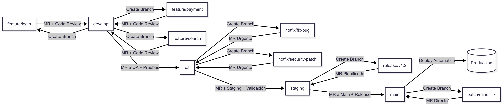

# ¿Qué es un Merge Request (MR)?

Un **Merge Request** (MR) es una solicitud para fusionar cambios de una rama de trabajo (*feature*, *hotfix*, *patch*, etc.) hacia otra rama principal dentro de un repositorio.  
Se utiliza principalmente para:

- **Revisar código** antes de integrarlo.
- **Asegurar calidad** mediante pruebas y validaciones.
- **Mantener un historial limpio** de cambios y versiones.
- **Coordinar trabajo en equipo** evitando conflictos.

El flujo típico de un MR implica:
1. Crear una rama a partir de la rama base (por ejemplo, `develop` o `main`).
2. Realizar los cambios y hacer *commits*.
3. Subir la rama al repositorio remoto.
4. Abrir un MR indicando la rama origen y la rama destino.
5. Revisar, aprobar y fusionar los cambios.

---

## Ejemplo de flujo de Merge Requests

En este diagrama se muestran ejemplos de cómo se crean ramas, se realizan *Merge Requests* y cómo fluye el código desde ramas de desarrollo hasta llegar a producción.
